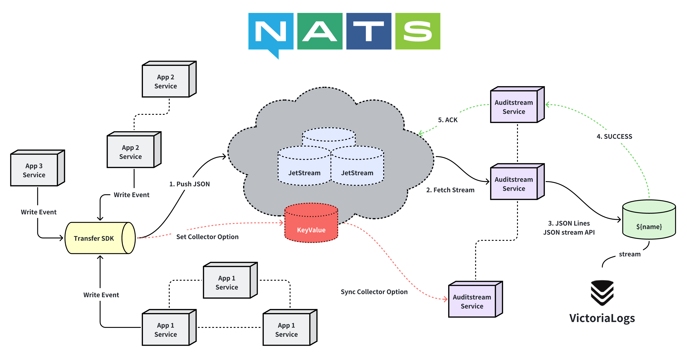

# AuditStream

[](https://github.com/kainonly/auditstream/actions/workflows/release.yml)
[](https://github.com/kainonly/auditstream/actions/workflows/testing.yml)
[](https://github.com/kainonly/auditstream/releases)
[](https://coveralls.io/github/kainonly/auditstream)
[](https://github.com/kainonly/auditstream)
[](https://goreportcard.com/report/github.com/kainonly/auditstream)
[](https://raw.githubusercontent.com/kainonly/auditstream/v3/LICENSE)

轻量级审计日志收集与持久化服务。从 NATS JetStream 队列消费审计事件，批量写入 VictoriaLogs 进行长期存储与分析。

## 概览



## 特性

- 基于 Push 模式从 NATS JetStream 消费消息
- 可配置的缓冲区批量写入 VictoriaLogs
- 启动时自动创建 Stream 和 Consumer
- 优雅关闭，确保最后一批数据写入
- 云原生设计：一个 Pod 消费一个 Stream，水平扩展

## 前置条件

- NATS JetStream 集群
- VictoriaLogs 实例

## 配置

创建 `config/values.yml`：

```yaml
mode: debug
namespace: alpha
stream: logs
nats_hosts:
  - nats://127.0.0.1:4222
nats_token: your-token
victoria: http://localhost:9428
victoria_path: /insert/jsonline?_stream_fields=stream&_msg_field=msg&_time_field=time
batch_size: 100
flush_interval: 5s
```

| 字段 | 说明 |
|------|------|
| `mode` | 日志模式：`debug` 或 `release` |
| `namespace` | 应用命名空间，用于 Stream 命名 |
| `stream` | Stream 名称（完整名称：`{namespace}_{stream}`） |
| `nats_hosts` | NATS 服务器地址列表 |
| `nats_token` | NATS 认证令牌 |
| `victoria` | VictoriaLogs 端点 URL |
| `victoria_path` | VictoriaLogs API 路径及查询参数 |
| `batch_size` | 缓冲区达到此数量时触发写入 |
| `flush_interval` | 定时写入间隔 |

本地测试可选加载 `.env`，示例见 `.env.example`。

## 数据流

```
┌─────────────┐     ┌─────────────┐     ┌─────────────┐
│  应用服务 A  │     │  应用服务 B  │     │  应用服务 C  │
└──────┬──────┘     └──────┬──────┘     └──────┬──────┘
       │                   │                   │
       └───────────────────┼───────────────────┘
                           │ 写入事件
                           ▼
                  ┌─────────────────┐
                  │  Transfer SDK   │
                  │  推送 JSON      │
                  └────────┬────────┘
                           │
                           ▼
┌─────────────────────────────────────────────────────────────┐
│                     NATS JetStream                          │
│  Stream: {namespace}_{stream}                               │
│  Subject: {namespace}.{stream}                              │
│  Consumer: default (工作队列模式)                            │
└───────────────────────────┬─────────────────────────────────┘
                            │ Consume()
                            ▼
┌─────────────────────────────────────────────────────────────┐
│                   AuditStream Pod                           │
│                                                             │
│   消息 ──► 缓冲区 ──► 写入 ──► POST /insert/jsonline         │
│              │                                              │
│      (达到 batch_size 或 flush_interval)                    │
└───────────────────────────┬─────────────────────────────────┘
                            │ 成功: ACK / 失败: NAK
                            ▼
                  ┌─────────────────────────┐
                  │      VictoriaLogs       │
                  └─────────────────────────┘
```

## 写入逻辑

两个条件任一满足即触发写入：

1. **数量触发**：缓冲区达到 `batch_size`（如 100 条）
2. **定时触发**：每隔 `flush_interval`（如 5 秒）

```
push(msg):
    加锁 → 追加到缓冲区 → 解锁
    if len(buffer) >= batch_size:
        flush()

flushLoop():
    每隔 flush_interval:
        flush()
    收到停止信号:
        flush()  // 关闭前最后写入一次

flush():
    加锁 → 交换缓冲区 → 解锁
    if 空: return
    write() → 成功: ACK 全部 / 失败: NAK 全部
```

## Transfer SDK

用于发送审计事件的客户端 SDK。

```go
import "github.com/kainonly/auditstream/v3/transfer"

// 创建客户端
t, err := transfer.New(nc, "namespace")

// 发送审计事件
event := transfer.NewAuditEvent("user-actions", "用户登录").
    WithAction("login").
    WithUser("user123", "192.168.1.1")
t.Publish(ctx, "audits", event)

// 异步发送
t.PublishAsync("audits", event)
```

### AuditEvent 字段

| 字段 | JSON | 说明 |
|------|------|------|
| Time | `time` | 事件时间 |
| Stream | `stream` | 日志流标识 |
| Msg | `msg` | 消息内容 |
| Action | `action` | 操作类型 |
| UserID | `user_id` | 用户 ID |
| ClientIP | `client_ip` | 客户端 IP |
| Resource | `resource` | 资源标识 |
| Extra | `extra` | 额外数据 |

## 水平扩展

部署多个 Pod 消费不同的 Stream：

```yaml
# Pod A: 消费 alpha_logs
stream: logs

# Pod B: 消费 alpha_auth
stream: auth

# Pod C: 消费 alpha_payments
stream: payments
```

## 许可证

[BSD-3-Clause License](LICENSE)
